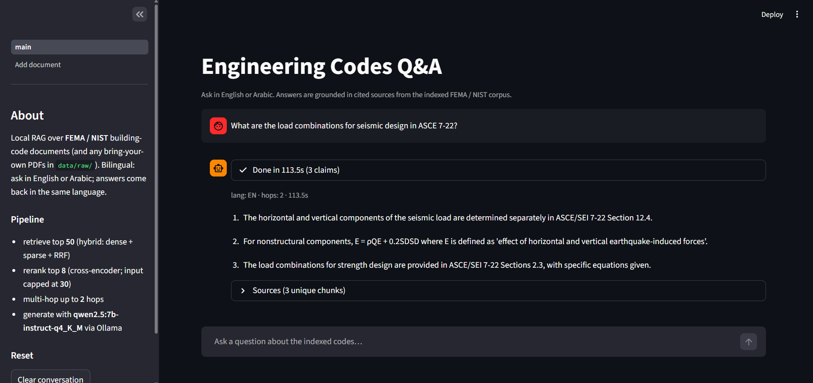

# engineering-codes-rag

Local bilingual (Arabic / English) Retrieval-Augmented Generation system for
building-code and technical engineering documents. Designed for a working
civil / architectural engineer to query technical content and get cited,
multi-source answers — running entirely on a single workstation with no
outbound network calls at query time.

The **public demo corpus** is three full-text, public-domain US Federal
Government documents covering NEHRP seismic design provisions (FEMA P-2082
Vol 1), worked seismic design examples (FEMA NEHRP Design Examples Vol 1),
and a survey of resilience in building codes (NIST TN 2209). They are
downloaded into your local `data/raw/` directory by the fetch script and
are not redistributed by this repo. See [`data/raw/MANIFEST.md`](data/raw/MANIFEST.md).

The **Egyptian Code of Practice (ECP)** and **Saudi Building Code (SBC)** are
supported as a **bring-your-own** corpus: drop legally-obtained PDFs in via
the Streamlit "Add document" page (or `data/raw/` + manifest entry) and the
ingestion pipeline — including Arabic-aware parsing and bilingual embeddings —
handles them. The project does not redistribute either code. See
[`NOTICE.md`](NOTICE.md).

> Status: **functional end-to-end.** All pipeline stages (fetch → parse →
> chunk → embed → hybrid retrieve → rerank → multi-hop → generate) are
> implemented, tested, and wired up behind a Streamlit chat UI plus a
> bring-your-own ingest UI. 164 unit tests passing, `mypy --strict` +
> `ruff` clean, CI green. Eval baseline: 12/16 on the structured
> regression set. Known limitations documented at the bottom.


*The chat UI answering an English question with cited FEMA / NIST sources.*

## What the system does

- **Fetches** the public-domain demo PDFs from fema.gov and nvlpubs.nist.gov
  with streaming SHA-256 verification, pinning hashes to a local lock file.
- **Parses** each PDF page-by-page, detecting language and refusing
  documents whose detected language disagrees with the manifest.
- **Chunks** with character-based sliding windows that snap to sentence
  boundaries, preserving page-number provenance per chunk.
- **Indexes** in Qdrant with hybrid named vectors (BGE-M3 dense + sparse).
- **Retrieves** with reciprocal-rank fusion across dense + sparse, then
  cross-encoder reranking, then deterministic multi-hop reference-following
  (e.g. "see §12.8.1" triggers a follow-up retrieval).
- **Generates** structured JSON answers via local Qwen2.5-7B-Instruct
  (Ollama). Every claim is grounded in a numbered chunk; out-of-scope
  questions get a clean empty-claims refusal, not a hallucination.
- **Translates** non-English queries to English for retrieval, then has the
  model answer in the user's original language. Arabic in → Arabic out.
- Runs **fully locally** — no outbound network at query time.

## Architecture

```
            ┌─────────────────────────────────────────────────────────┐
            │ Ingest (one-time per document)                          │
            │                                                         │
            │   fetch → parse → chunk → embed → [Qdrant index]        │
            └─────────────────────────────────────────────────────────┘
                                              │
            ┌─────────────────────────────────┼───────────────────────┐
            │ Query (per user question)       ▼                       │
            │                                                         │
            │   translate (if non-EN) → hybrid retrieve →             │
            │   rerank (cross-encoder) → multi-hop loop →             │
            │   generate (Qwen2.5-7B via Ollama, JSON-schema mode) →  │
            │   citation resolution → Answer                          │
            └─────────────────────────────────────────────────────────┘
                                              │
                                              ▼
                                       Streamlit UI
                                  (chat + add-document)
```

Each stage is an independent Python module under its own package
(`ingest/`, `retrieval/`, `generation/`, `app/`) with its own CLI entrypoint
and tests. Stages communicate via JSONL files on disk under
`data/processed/`, so any stage can be re-run in isolation against the prior
stage's output. Stage I/O schemas live in [`common/models.py`](common/models.py).

### Ingest pipeline — how a PDF becomes a queryable index

The ingest pipeline is four stages that each read from disk, write to disk,
and validate their inputs against strict Pydantic schemas. A failure in one
stage stops that document — never the whole batch — and writes a typed
exception with full context to the log. Stages are idempotent: re-running
on an already-processed document is a no-op.

**1. fetch — download + integrity-pin** ([`ingest/fetch.py`](ingest/fetch.py))

- Reads the document list from `data/raw/manifest.json` (validated as a
  list of `DocumentMeta` Pydantic models — bad entries fail loudly at
  parse time, never mid-download).
- For each entry, streams the source PDF to `data/raw/{doc_id}.pdf`
  while computing SHA-256 in the same loop (no separate hash pass).
- Cross-checks the computed hash against `data/raw/manifest.lock.json`:
  - First-ever download → pin the hash to the lock file.
  - Hash matches lock → accept the file.
  - **Hash disagrees → delete the file and raise `ChecksumMismatchError`.**
    Treated as a tamper signal; aborts the run rather than silently
    continuing with possibly-corrupt content.
- Transient HTTP failures retry with exponential backoff via `tenacity`;
  retries log a WARNING each, never silent.
- Already-present files are re-verified, not skipped. Catches local file
  rot and detects upstream content changes against the pinned hash.

**2. parse — PDF → per-page JSONL** ([`ingest/parse.py`](ingest/parse.py))

- Opens each PDF with `pypdfium2` (BSD-3, no AGPL surprises like PyMuPDF).
- Extracts text per page with 1-indexed page numbers preserved as the
  primary citation key — every chunk, citation, and answer can trace back
  to specific source pages.
- Detects language per page with `langdetect` (seeded for reproducibility).
  A document's majority language must match the manifest's
  `expected_language`; mismatch raises `LanguageMismatchError` and the
  file is excluded rather than silently mislabeled in the index.
- Empty / zero-page PDFs raise `ParseError` (collected per-doc, never
  aborts the batch).
- Output: `data/processed/parsed/{doc_id}.jsonl`, one `ParsedPage`
  record per line.

**3. chunk — pages → retrieval units** ([`ingest/chunk.py`](ingest/chunk.py))

- Concatenates non-empty pages into one buffer while tracking each
  page's `(start, end)` char-offset range. This is what lets a single
  chunk cite multiple pages when it spans a page boundary.
- Walks a sliding window: `chunk_target_chars=2048` (~512 tokens for
  English) with `chunk_overlap_chars=200` overlap so context isn't lost
  at boundaries.
- Snaps each window's end to the nearest paragraph break (`\n\n`),
  sentence end (`.`), or line break — within the last 20% of the window
  — so chunks don't cut mid-sentence.
- Maps every chunk back to its source page numbers using the offset
  ranges from step 1. A chunk covering bytes 1900–3900 might list pages
  `[7, 8]`; the answer's citations will say `p.7-8` accordingly.
- Re-detects each chunk's language (a chunk can span pages of different
  languages — important for bilingual PDFs).
- Output: `data/processed/chunks/{doc_id}.jsonl`, one `Chunk` record
  per line with a stable hash-based `chunk_id`.

**4. embed — chunks → Qdrant** ([`ingest/embed.py`](ingest/embed.py))

- Loads BGE-M3 once per process (cached under `~/.cache/huggingface/`
  after first run; ~2 GB).
- For each chunk, produces in one model pass:
  - **dense vector** — 1024-dim semantic embedding for cosine similarity
  - **sparse vector** — learned lexical weights (smart BM25-style),
    which is what lets equation-heavy chunks survive even when their
    dense embedding is far from the natural-language query
- Upserts into a Qdrant collection with **named vectors** (`dense` and
  `sparse` as separate named slots), so the retrieval stage can run
  both searches and fuse with reciprocal-rank fusion.
- Per-doc **resume**: before encoding, scrolls the collection for
  existing chunk_ids and skips anything already indexed. Re-running
  `embed` on a fully-indexed corpus is a ~1s no-op.
- Hard-fails on:
  - `QdrantUnavailableError` — server down or unreachable, raised at
    startup not at first upsert
  - `CollectionSchemaMismatchError` — existing collection has different
    vector dims or named-vector layout; refuses to silently migrate
- Soft-fails (per-batch, logged + collected) on encode/upsert errors so
  one bad batch doesn't kill the whole document.

**Engineer-facing UI for ingest.** The Streamlit "Add document" page
(`app/pages/2_Add_document.py`) wraps the four-stage CLI flow into a
form: upload PDF, fill 4 metadata fields, click Ingest. The file is
saved to `data/raw/`, a manifest entry is appended atomically, then
fetch (hash-pin only — file's already on disk) → parse → chunk → embed
run sequentially with live status. New chunks become queryable on the
chat page as soon as `embed` finishes.

## Tech stack

| Layer | Tool | Why |
|---|---|---|
| LLM | Qwen2.5-7B-Instruct (Q4_K_M GGUF) via **Ollama** | Strong Arabic + English, fits in 8 GB VRAM |
| Embeddings | **BGE-M3** | Multilingual; produces dense + sparse vectors from one model |
| Reranker | **BAAI/bge-reranker-v2-m3** | Same family, multilingual cross-encoder |
| Vector store | **Qdrant** (Docker) | Native hybrid dense + sparse, RRF built-in |
| UI | **Streamlit** | Two-page chat + bring-your-own ingest |
| Validation | **Pydantic v2** | Strict stage I/O contracts (`extra="forbid"`) |
| Logging | **loguru** | Structured JSON to disk + console |
| Lint / type | **ruff** + **mypy --strict** | Enforces no-silent-failure rules |

## Engineering rules baked into the code

These are not just guidelines — they are enforced by tooling.

1. **No silent failures.** `BLE001` and `TRY` ruff rules ban bare `except:`
   and `except Exception: pass`. Every failure mode has a named exception in
   [`common/errors.py`](common/errors.py).
2. **Strict validation at stage boundaries.** Every Pydantic model uses
   `extra="forbid"`; invalid input fails immediately, never silently.
3. **Warnings are errors.** `pytest` treats warnings as errors, so a
   deprecation never sneaks in unnoticed.
4. **Strict typing.** `mypy --strict` is mandatory.
5. **Health checks at startup**, not at first query. The pipeline refuses
   to start a query if Qdrant or Ollama is unreachable, with a recovery
   command in the error message.
6. **Checksums on every downloaded PDF.** Fetch pins SHA-256 to
   `data/raw/manifest.lock.json` and deletes any file that fails verification.

## Security model

See [`SECURITY.md`](SECURITY.md). Short version: this is for single-user or
**trusted LAN** use. There is no built-in authentication. Do not expose to the
public internet without a reverse proxy. PDF parsing is an attack surface —
only ingest PDFs from sources you trust.

## Getting started

> Requires Python 3.11 or 3.12 (project does not yet support 3.13),
> Docker (for Qdrant), and the Ollama desktop app.

### 1. Code + environment

```powershell
git clone https://github.com/TheRedCan/RAG-engineering-codes-Q-A.git
cd "RAG-engineering-codes-Q-A"

conda create -n engineering-codes-rag python=3.12 -y
conda activate engineering-codes-rag

pip install -e ".[dev,ingest,embed,retrieval,generation,app]"
pre-commit install
cp .env.example .env   # optional — defaults are fine for localhost
```

### 2. Start the local services

```powershell
# Qdrant — vector database
docker compose -f serving/docker-compose.yml up -d

# Ollama — local LLM runtime. Install from https://ollama.com if needed.
# Then pull the model (~4.5 GB):
ollama pull qwen2.5:7b-instruct-q4_K_M
```

### 3. Build the corpus (one-time)

```powershell
python -m ingest.fetch    # download + hash-pin public PDFs
python -m ingest.parse    # PDF -> per-page JSONL
python -m ingest.chunk    # pages -> retrieval chunks
python -m ingest.embed    # encode + upsert to Qdrant
```

Embedding takes ~30 minutes on a 16 GB-RAM laptop the first time the
BGE-M3 model is downloaded; subsequent runs reuse the cached weights.

### 4. Run the app

```powershell
streamlit run app/main.py --server.address 127.0.0.1
```

Browse to **http://127.0.0.1:8501**. Two pages live in the sidebar:

- **main** — chat-style Q&A. Citations expander under each answer,
  Arabic right-to-left rendering, live pipeline settings in the sidebar.
- **Add document** — upload a PDF, fill 4 metadata fields, click Ingest.
  Runs verify → parse → chunk → embed end-to-end with live status; new
  chunks become queryable on the chat page as soon as embed finishes.

Or use the CLI instead:

```powershell
python -m generation.answer "How is the seismic base shear calculated?"
```

## Performance

Measured on an RTX 4060 laptop (8 GB VRAM, 16 GB RAM, Windows 11), 1,872
indexed chunks. Single user, cold-cache stages amortized across the run:

| Query | Time | Notes |
|---|---|---|
| Equation extraction (English) | ~99s | 4 substantive claims, 3 unique chunks cited |
| Conceptual / definition (English) | ~67s | 2 claims, on-topic |
| Specific code section (English) | ~63s | 1 claim with section requirement |
| Different sub-corpus (NIST resilience) | ~74s | 4 claims, full coverage |
| Arabic load combinations | ~75s | 5 Arabic claims, **includes verbatim equations** `U = 1.4D, U = 1.2D + 1.6L, ...` |
| Out-of-scope (Egyptian Code request) | ~63s | Graceful response noting scope mismatch |

**Where the time goes** (per query, CPU-bound stages dominate):

| Stage | Time | Bottleneck |
|---|---|---|
| Translation (only non-EN) | ~0-10s | Ollama LLM call |
| Hybrid retrieve + multi-hop | ~6s | Qdrant + BGE-M3 |
| **Cross-encoder rerank (30 pairs)** | **~55s** | CPU at ~1.2s/pair |
| **LLM generation (Qwen-7B-Q4 on 8 GB GPU)** | **~30s** | quantized small model |

### Scalability — what stronger hardware buys you

| Hardware | Per-query latency | What changes |
|---|---|---|
| RTX 4060 laptop (this baseline) | ~90s | current |
| RTX 4090 / A6000 (24 GB) workstation | ~20-25s | both models on GPU; unquantized 7B |
| A100/H100 server, vLLM batching | ~8-12s | vLLM replaces Ollama for the LLM serving |
| Same + hosted LLM API | ~5s | trades local-only privacy for speed |

Nothing in the architecture assumes single-user; Qdrant and Ollama can be
remote services with `QDRANT_HOST` / `OLLAMA_HOST` env vars.

## Running tests

```powershell
pytest -m "not integration" --no-cov    # fast unit tests (~4s, 164 cases)
pytest                                  # full suite (requires Qdrant + Ollama)
python -m scripts.smoke_queries         # 6-query informal regression battery
python -m eval.run                      # 16-case structured eval with pass/fail
python -m eval.run --ids cs-coefficient # single case for quick iteration
```

The eval harness ([`eval/`](eval/)) measures structural correctness over
hand-curated test cases — language match, citation requirements, required
/ forbidden keywords, refusal behavior, latency budget. Results write to
`eval/results/{UTC-timestamp}.json` (gitignored) for trend comparison.
Exit code is 0 iff every case passes, so the harness can be a pre-release
gate or used with `git bisect`. Full run takes ~20 min on the baseline
laptop. No LLM-as-judge calls — every metric is deterministic.

## Repo layout

```
.
├─ common/                # shared infra: errors, logging, models, settings
├─ ingest/                # fetch -> parse -> chunk -> embed
├─ retrieval/             # hybrid + rerank + multi-hop
├─ generation/            # prompting, translation, answer orchestration
├─ app/                   # Streamlit UI (main.py + pages/)
├─ serving/               # docker-compose for Qdrant
├─ scripts/               # smoke battery + ad-hoc tools
├─ data/
│  ├─ raw/                # source PDFs (gitignored) + MANIFEST.md + manifest.json
│  └─ processed/          # parsed/chunked JSONL (gitignored)
├─ index/                 # Qdrant persistent storage (gitignored)
├─ models/                # local model cache (gitignored)
├─ tests/
│  ├─ unit/               # 128 mock-based unit tests
│  └─ integration/        # live Qdrant + Ollama tests
└─ pyproject.toml
```

## Known limitations

- **Cs / variable-disambiguation queries.** A generic question like "How is
  Cs calculated?" can land on the wrong Cs variant (Chapter 17 isolation
  systems instead of Chapter 12 ELF) because the cross-encoder ranks any
  chunk containing "Cs" similarly. Asking specifically — e.g. "Cs for the
  equivalent lateral force procedure under ASCE 7-22 §12.8" — gets the
  right chunk. Tracked as future work pending an eval harness.
- **Scanned-image PDFs are not OCR'd.** v0.1 only handles text-extractable
  PDFs. Adding OCR is straightforward (pytesseract or similar) but adds a
  ~50 MB dependency footprint.
- **PDF equation extraction is fragile.** Multi-column equations sometimes
  get scrambled by pypdfium2 (e.g. `Cs = SDS / (R/Ie)` may land in the
  index as `1.00 0.192 6.5 1.25 DS s e S C R I = = =`). The LLM is
  instructed to reconstruct these but small quantized models don't always
  succeed.
- **Single-user, localhost-by-default.** No authentication, no rate
  limiting, no multi-tenant isolation. Suitable for a single engineer's
  workstation or a trusted LAN behind a reverse proxy.

## License

Code: Apache-2.0 (see [`LICENSE`](LICENSE)). Third-party content (codes,
models) is not redistributed; see [`NOTICE.md`](NOTICE.md).
